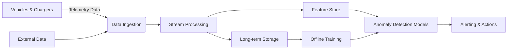

### System Design for Anomaly Detection in Tesla Charging Patterns

#### **1. Problem Analysis & Requirements**
- **Goal**: Detect abnormal charging behaviors (e.g., unexpected interruptions, slow charging, overheating, energy theft).
- **Key Metrics**:
  - **Accuracy**: Minimize false positives (e.g., avoid alerting for planned overnight charging).
  - **Latency**: Near real-time detection (seconds to minutes).
  - **Scale**: Support millions of vehicles, thousands of Superchargers, and frequent telemetry pings (e.g., 1-5 sec intervals).
  - **Reliability**: 99.95% uptime; handle edge cases (e.g., offline vehicles, network failures).
- **Anomaly Examples**:
  - Abrupt power drops during peak charging.
  - Unusually long sessions for small SoC (State of Charge) gains.
  - Temperature spikes beyond safe thresholds.
  - Geographic anomalies (e.g., charging in unauthorized locations).

---

#### **2. High-Level Architecture**

---

#### **3. Component Deep Dive**

##### **A. Data Ingestion**
- **Sources**:
  - **Vehicles**: SoC, voltage, current, temperature, GPS, session start/end timestamps.
  - **Chargers**: Power output (kW), connector type, location, error codes.
  - **External Data**: Weather APIs (ambient temperature), grid load data, charger firmware versions.
- **Tools**:
  - **Protocol**: Protobuf over MQTT (low bandwidth, high reliability).
  - **Ingestion Layer**: Apache Kafka (partitioned by `vehicle_id`/`charger_id`) + AWS Kinesis for scalability.  
    *Throughput*: 500K events/sec (assuming 1M vehicles × 1 event/2 sec).

##### **B. Stream Processing (Real-Time)**
- **Tasks**:
  - Data validation, deduplication, and enrichment (e.g., join vehicle metadata).
  - Compute real-time features:
    - `ChargingRateStability`: Std. deviation of kW over 1-min windows.
    - `SoCGainEfficiency`: (ΔSoC / energy delivered) vs. historical baseline.
    - `ThermalGradient`: Rate of temperature change.
- **Tools**: Apache Flink (stateful processing, exactly-once semantics).

##### **C. Feature Store**
- **Purpose**: Serve consistent features for training/inference.
- **Features**:
  - **Real-time**: Session duration, current power draw.
  - **Historical**: Avg. charging rate per vehicle (7-day window), typical session duration by location/time.
- **Storage**: 
  - **Online**: Redis (low-latency access for streaming models).
  - **Offline**: Delta Lake on S3 (for batch training).

##### **D. Anomaly Detection Models**
- **Strategy**: Hybrid approach to balance precision and recall.
  - **Rule-Based (Fast Path)**:
    - Hard thresholds: `temperature > 60°C`, `power drop > 50% in 10 sec`.
    - Geofencing: Alert if charging outside registered locations.
  - **ML Models (Context-Aware)**:
    - **Unsupervised** (for novel anomalies):
      - *Isolation Forest*: For multidimensional outliers (power, temp, duration).
      - *LSTM Autoencoder*: Reconstruct charging sequences; flag high reconstruction error.
    - **Supervised** (if labeled data exists):
      - *Gradient Boosting (XGBoost)*: Train on historical anomalies (e.g., confirmed battery faults).
  - **Ensemble**: Combine rule-based alerts with ML scores (weighted voting).

##### **E. Alerting & Actions**
- **Tiers**:
  - **Tier 1 (User)**: Push notification via Tesla app for minor issues (e.g., "Charging paused. Check connector.").
  - **Tier 2 (Service Center)**: Auto-create service tickets for critical anomalies (e.g., thermal runaway risk).
  - **Tier 3 (Grid Ops)**: Notify utility partners for grid-side issues (e.g., voltage sags at Supercharger sites).
- **Deduplication**: Group related alerts (e.g., same vehicle + same charger within 5 mins).

##### **F. Data Storage & Offline Processing**
- **Hot Storage**: TimescaleDB (time-series data for recent sessions; retention: 7 days).
- **Cold Storage**: S3 + Athena (raw telemetry; retention: 2 years).
- **Batch Pipeline**:
  - Daily retraining of ML models using Airflow.
  - Feature drift detection (e.g., KS test on power distribution).

---

#### **4. Scalability & Reliability**
- **Ingestion**: Kafka partitions scaled by `vehicle_id` hash; auto-scaling consumers.
- **Processing**: Flink job parallelism adjusted dynamically based on backlog.
- **Fault Tolerance**:
  - Kafka replication factor=3; Flink checkpointing every 10 sec.
  - Dead-letter queue for failed events (replay via Lambda).
- **Cost Optimization**:
  - Downsample non-critical telemetry (e.g., GPS pings at 1/min when parked).
  - Use spot instances for offline training.

---

#### **5. Privacy & Security**
- **Data Masking**: Anonymize VINs in non-production environments.
- **Encryption**: TLS 1.3 for data in transit; AES-256 for data at rest.
- **Access Control**: RBAC via Vault; audit logs for data access.

---

#### **6. Evaluation & Iteration**
- **Metrics**:
  - Precision/Recall: Measured against labeled service logs.
  - MTTD (Mean Time to Detect): Target < 60 sec for critical anomalies.
- **A/B Testing**: Roll out new models to 5% of vehicles; compare false positive rates.
- **Human-in-the-Loop**: Service technicians label ambiguous alerts to retrain models.

---

#### **7. Key Trade-offs**
- **Latency vs. Accuracy**: 
  - Real-time rules trigger immediately; ML models use 1-min windows for richer context.
- **Coverage vs. Cost**: 
  - Rule-based covers 80% of known issues cheaply; ML handles edge cases (higher compute cost).
- **Edge vs. Cloud**: 
  - Critical thermal rules run on-vehicle (to cut power instantly); complex analysis in cloud.

---

#### **8. Future Extensions**
- **Predictive Maintenance**: Correlate charging anomalies with battery degradation models.
- **Fleet-Wide Patterns**: Detect grid failures by clustering anomalies across chargers in a region.
- **User Customization**: Allow users to tag false positives (e.g., "I use a third-party charger").

This design balances real-time responsiveness with contextual accuracy, leveraging Tesla’s existing telemetry infrastructure while ensuring safety-critical alerts are never delayed. By combining rules and ML, it adapts to both known and novel anomalies at scale.
